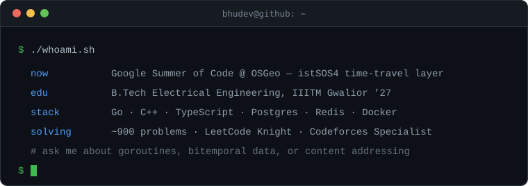

<!--
  bhudevbhanpuriya/bhudevbhanpuriya  ·  profile README
  Zero external image services. Everything below is either markdown or an SVG
  that lives in this repo, so nothing breaks when someone else's API goes down.

  Repo layout:
    README.md
    assets/header.svg
    assets/whoami.svg
    assets/stack.svg
    assets/stats.svg
-->

<div align="center">
  
</div>

<br/>

<div align="center"><code>bhudev@github ~ $ ./whoami.sh</code></div>

<br/>

<div align="center">
  
</div>

<br/>

## about

```go
package main

type Bhudev struct {
	Name     string
	College  string
	Now      string
	Focus    []string
	Learning []string
	Reach    string
}

func main() {
	me := Bhudev{
		Name:     "Bhudev Bhanpuriya",
		College:  "IIITM Gwalior · B.Tech EE · 2023–2027",
		Now:      "GSoC @ OSGeo — time-travel query layer for istSOS4",
		Focus:    []string{"backend", "distributed systems", "open source"},
		Learning: []string{"Go internals", "system design", "database internals"},
		Reach:    "bhudevbhanp@gmail.com",
	}
	_ = me // still under construction, like everything else
}
```

---

## stack

<div align="center">
  
</div>

---

## by the numbers

<div align="center">
  
</div>

---

## projects

**[peervault/](https://github.com/bhudevbhanpuriya/peervault)** &nbsp;·&nbsp; `go` `aes-256-ctr` `mdns`
Peer-to-peer encrypted file storage. Content-addressable over SHA-256 for dedup and
corruption detection, streaming encryption at a flat 32KB of memory whatever the file
size, and self-healing discovery (mDNS + bootstrap + PEX) that re-replicates whatever
a dead node took with it.

**[campushub/](https://github.com/bhudevbhanpuriya/campushub)** &nbsp;·&nbsp; `next.js` `mongodb` `redis`
Campus events platform. Reddit-style threaded comments assembled from parent references,
semantic search so students find events by meaning instead of keywords, and a
controller–service–repository backend with cron reminders and cached reads.

**[codein-it/](https://github.com/bhudevbhanpuriya/codein-it)** &nbsp;·&nbsp; `monaco` `yjs`
Collaborative coding playground. Real-time multi-cursor editing on Monaco, conflict-free
via CRDTs.

---

## competitive programming

| platform | handle | where I'm at |
|:--|:--|:--|
| **LeetCode** | [bhudev03](https://leetcode.com/bhudev03/) | Knight · 1863 · 720+ solved · top 5.52% |
| **Codeforces** | [bhudevbhanpuriya](https://codeforces.com/profile/bhudevbhanpuriya) | Specialist · Div. 2/3 regular |
| **CodeChef** | [bhudevbhanpuriya](https://www.codechef.com/users/bhudevbhanpuriya) | global rank 61 · Starters 194 |

```
$ wc -l ~/solutions/*.cpp | tail -1
  900+ total   # C++ mostly, Go when I want to suffer differently
```

---

## connect

[portfolio](https://bhudev.vercel.app) &nbsp;·&nbsp;
[linkedin](https://linkedin.com/in/bhudev-bhanpuriya) &nbsp;·&nbsp;
[leetcode](https://leetcode.com/bhudev03/) &nbsp;·&nbsp;
[writing](https://medium.com/@bhudevbhanp) &nbsp;·&nbsp;
[email](mailto:bhudevbhanp@gmail.com)

<br/>

<div align="center"><sub><code>exit 0</code></sub></div>
